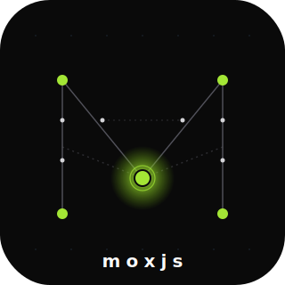

<p align="center">
  <picture>
    <source media="(prefers-color-scheme: dark)" srcset="logo/09-orchestrator-node.svg">
    <source media="(prefers-color-scheme: light)" srcset="logo/09-orchestrator-node-light.svg">
    
  </picture>
</p>

<h1 align="center">JORVEL</h1>

<p align="center">
  <strong>Opinionated micro-frontend framework + tooling built on Rspack Module Federation.</strong>
</p>

<p align="center">
  <a href="https://jorveljs.vercel.app/">Website</a> ·
  <a href="https://jorveljs.vercel.app/docs">Docs</a> ·
  <a href="https://jorveljs.vercel.app/docs/getting-started">Quickstart</a> ·
  <a href="https://github.com/Ravikisha/JorvelJS">GitHub</a> ·
  <a href="https://github.com/Ravikisha/JorvelJS/issues">Issues</a>
</p>

<p align="center">
  <a href="https://www.npmjs.com/package/jorvel"></a>
  <a href="https://www.npmjs.com/package/@jorvel/runtime"></a>
  <a href="https://www.npmjs.com/package/@jorvel/ssr"></a>
  <a href="https://github.com/Ravikisha/JorvelJS/blob/main/LICENSE"></a>
  <a href="https://github.com/Ravikisha/JorvelJS/stargazers"></a>
  <a href="https://github.com/Ravikisha/JorvelJS/issues"></a>
  <a href="https://github.com/Ravikisha/JorvelJS/pulls"></a>
  <a href="https://github.com/Ravikisha/JorvelJS/commits/main"></a>
  <br>
  
  
  
  
  
  <a href="https://jorveljs.vercel.app/"></a>
</p>

---

## Why JORVEL?

Micro-frontends solve a real problem — independent teams shipping independent frontends on independent cadences — but the tooling around them is fragmented. JORVEL bundles the missing pieces into one opinionated framework:

- **Module Federation, configured for you.** Rspack `ModuleFederationPlugin` with React-singleton sharing, SRI, allowlists, CDN-aware public-path — out of the box.
- **A real router.** Two-tier (host owns prefixes, remotes own sub-paths), file-based, typed, guarded, prefetch-aware. No `react-router` dependency.
- **SSR + SSG + Edge.** Render to string, stream to a `ReadableStream`, export to disk, deploy to Vercel Edge / Cloudflare Workers / Node / Docker.
- **A production toolbelt.** CSP builder, SRI helpers, RUM beacon, structured logger, Web Vitals, rate limiter, audit log — all edge-runtime safe.
- **Cross-app primitives.** Event bus with typed schemas, shared state with `globalThis` fallback, i18n with ICU-lite interpolation.
- **A CLI that scaffolds the whole thing.** `jorvel init` → workspace + CI + ESLint + Vitest + Playwright in one go.

> **Live demo + full docs:** **<https://jorveljs.vercel.app/>**

---

## Install

All packages live under the [`@jorvel`](https://www.npmjs.com/org/jorvel) scope on npm.

```sh
# CLI (one-shot, no install needed)
pnpm dlx jorvel@latest init my-app

# Or install per-package
pnpm add @jorvel/runtime @jorvel/ssr @jorvel/security
pnpm add -D jorvel @jorvel/types @jorvel/tsconfig @jorvel/eslint-config @jorvel/prettier-config
```

Full package index → <https://www.npmjs.com/org/jorvel>.

## Quickstart

```sh
# 1. Scaffold a workspace
pnpm dlx jorvel@latest init my-app
cd my-app

# 2. Generate host + remote
jorvel scaffold app           # interactive
# or non-interactive:
# jorvel generate host shell --port 3000
# jorvel generate remote dashboard --port 3001
# jorvel federation

# 3. Run dev server (same-origin remotes + HMR)
jorvel dev --proxy-remotes --hmr-remotes
```

Open <http://localhost:3000>. Drop a file in `apps/dashboard/src/pages/` and `jorvel routes` picks it up.

### With Tailwind

```sh
jorvel init my-app --tailwind
# or per app:
jorvel generate host shell --tailwind
jorvel generate remote dashboard --tailwind
```

---

## Monorepo layout

| Path | Package | Purpose |
|---|---|---|
| `packages/cli` | [`jorvel`](https://www.npmjs.com/package/jorvel) | `jorvel` CLI — init / generate / dev / build / federation / routes / deploy / SSR |
| `libs/runtime` | [`@jorvel/runtime`](https://www.npmjs.com/package/@jorvel/runtime) | Router, routing components, hooks, remote loader, prefetch, islands, View Transitions, Shadow DOM, image, fonts |
| `libs/ssr` | [`@jorvel/ssr`](https://www.npmjs.com/package/@jorvel/ssr) | `renderRouteToString`, streaming SSR, static export, edge adapter, loaders, fragments, request context |
| `libs/security` | [`@jorvel/security`](https://www.npmjs.com/package/@jorvel/security) | CSP, SRI, origin allowlist, rate limit, audit log, OAuth helpers, sanitize |
| `libs/observability` | [`@jorvel/observability`](https://www.npmjs.com/package/@jorvel/observability) | Hooks, structured logger, Web Vitals, Sentry / OTel / console adapters, RUM beacon |
| `libs/state` | [`@jorvel/state`](https://www.npmjs.com/package/@jorvel/state) | Simple store, reducer store, selectors, middleware, devtools |
| `libs/event-bus` | [`@jorvel/event-bus`](https://www.npmjs.com/package/@jorvel/event-bus) | Typed pub/sub, replay, schema validation, cross-tab broadcast |
| `libs/i18n` | [`@jorvel/i18n`](https://www.npmjs.com/package/@jorvel/i18n) | ICU-lite interpolation, lazy catalogs, locale detection |
| `libs/ui` | [`@jorvel/ui`](https://www.npmjs.com/package/@jorvel/ui) | Headless-ish primitives — Button, Input, Modal, Toast, Card, ThemeProvider |
| `libs/adapter-vercel` | [`@jorvel/adapter-vercel`](https://www.npmjs.com/package/@jorvel/adapter-vercel) | Vercel Edge handler factory |
| `libs/adapter-cloudflare` | [`@jorvel/adapter-cloudflare`](https://www.npmjs.com/package/@jorvel/adapter-cloudflare) | Cloudflare Workers / Pages handler |
| `libs/adapter-node` | [`@jorvel/adapter-node`](https://www.npmjs.com/package/@jorvel/adapter-node) | Hardened Node server |
| `libs/types` | [`@jorvel/types`](https://www.npmjs.com/package/@jorvel/types) | Shared types + federation contract DSL + JSON Schemas |
| `libs/events` | [`@jorvel/events`](https://www.npmjs.com/package/@jorvel/events) | Shared event-name + payload registry |
| `libs/rspack-route-assets` | [`@jorvel/rspack-route-assets`](https://www.npmjs.com/package/@jorvel/rspack-route-assets) | Per-route asset manifest plugin |
| `libs/eslint-config` | [`@jorvel/eslint-config`](https://www.npmjs.com/package/@jorvel/eslint-config) | Shared ESLint 9 flat config |
| `libs/prettier-config` | [`@jorvel/prettier-config`](https://www.npmjs.com/package/@jorvel/prettier-config) | Shared Prettier config |
| `libs/tsconfig` | [`@jorvel/tsconfig`](https://www.npmjs.com/package/@jorvel/tsconfig) | Shared TypeScript presets |
| `docs/` | — | Documentation site (Next.js 16) |
| `examples/basic` | — | Runnable host + remote example |

---

## Feature tour

### Routing — two-tier, History API native

```tsx
// shell/src/bootstrap.tsx
import { NavLink, RemoteOutlet, getRouter } from '@jorvel/runtime';
import type { RouteTarget } from '@jorvel/runtime';

const HOST_ROUTES: RouteTarget[] = [
  { path: '/dashboard/*', remote: 'dashboard', module: './App' },
  { path: '/',            remote: 'dashboard', module: './App' },
];

const REMOTES = { dashboard: () => import('dashboard/App') };

getRouter();  // singleton, StrictMode-safe

export default function App() {
  return (
    <>
      <header>
        <NavLink to="/" label="Home" />
        <NavLink to="/dashboard/settings" label="Settings" prefetch />
      </header>
      <main>
        <RemoteOutlet routes={HOST_ROUTES} remotes={REMOTES} />
      </main>
    </>
  );
}
```

File-based pages in remotes:

| File | Route |
|---|---|
| `src/pages/index.tsx` | `/` |
| `src/pages/settings.tsx` | `/settings` |
| `src/pages/users/[id].tsx` | `/users/:id` |
| `src/pages/(marketing)/about.tsx` | `/about` (group) |

Run `jorvel routes` (or `jorvel routes --watch`) to generate `src/jorvel.routes.ts`.

### Federation — Rspack Module Federation, sane defaults

- Host sets `eager: true` on shared React, remote sets `eager: false`.
- Auto-detection: `jorvel federation` reads `jorvel.app.json` and infers exposes + shared.
- SRI: `federation.sri.algo = "sha384"` on every `remoteEntry.js`.
- Origin allowlist with `*` / `**` wildcards.

### SSR & SSG

```sh
jorvel ssr export                          # static export
jorvel ssr serve --port 3000               # streaming Node server
jorvel ssr serve --port 3000 --no-stream   # disable streaming
```

Programmatic surface:

- `renderRouteToString` + `injectIntoTemplate`
- `renderRouteToStream` (Node) / `renderRouteToReadableStream` (edge)
- `staticExport()`, `revalidateStaticPages()`
- `createEdgeAdapter()` — Vercel Edge / CF Workers / Deno
- `ssrRenderRemote`, `createSsrRemoteOutlet` — server-side remote rendering
- `defineLoader` / `useLoaderData` — server-only data fetchers

### Production toolbelt

| Concern | Package | Highlights |
|---|---|---|
| Security | `@jorvel/security` | `buildCsp` strict-dynamic + nonce, `sriHash`, `RemoteAllowlist`, `createRateLimitGuard`, `AuditLogger`, OAuth PKCE helpers |
| Observability | `@jorvel/observability` | `onError` / `onMetric` / `onRemoteLoad`, Web Vitals, Sentry + OTel adapters, RUM beacon |
| Shared state | `@jorvel/state` | `getStore` / `getSimpleStore`, middleware (thunk/logger/persistence), Redux DevTools |
| Cross-app events | `@jorvel/event-bus` | Typed `EventBus`, replay-on-subscribe, schema validation, `BroadcastChannel` cross-tab |
| i18n | `@jorvel/i18n` | ICU-lite plural arms, lazy catalogs, `detectLocale(acceptLanguage, supported, fallback)` |
| UI primitives | `@jorvel/ui` | Button, Input, Modal, Toast, Card, ThemeProvider + Storybook scaffold |

### Runtime extras

- **Prefetch on hover.** `<NavLink prefetch />` warms the next remote bundle.
- **Concurrent preload.** `preloadRemotes(...)` after first paint, bounded concurrency + idle scheduling.
- **View Transitions.** `navigateWithTransition`, reduced-motion safe, fallback to plain swap.
- **Islands hydration.** `<Island strategy="visible" load={...} />` — five strategies.
- **CSS isolation.** `ShadowRemote` or `scopeCss`.
- **Service Worker.** `jorvel sw generate` + `registerJorvelServiceWorker`.
- **Image + fonts.** `<Image />`, `buildSrcset`, `buildFontFaceCss`, Google Fonts URL composer.
- **Resilience.** `withRetry`, `createCircuitBreaker`, `withTimeout`.
- **Blue/green + weighted remotes.** Canary, fail-over, deterministic flip.
- **Feature flags.** Pluggable provider, `useFeatureFlag` hook.

---

## Deployment

`jorvel deploy --target <vercel|cloudflare|node|docker>` scaffolds the adapter and platform config.

| Target | Package | Notes |
|---|---|---|
| Vercel Edge | `@jorvel/adapter-vercel` | `export const config = { runtime: 'edge' }` |
| Cloudflare Workers / Pages | `@jorvel/adapter-cloudflare` | KV-backed HTML cache; Durable Objects ready |
| Node | `@jorvel/adapter-node` | Slowloris-hardened defaults, graceful SIGTERM |
| Docker | — | Multi-stage Dockerfile, optional K8s manifests |

Pop remotes onto a CDN — set `federation.publicPath` in `jorvel.config.ts`.

---

## Dev workflow

```sh
# Most common
jorvel dev --proxy-remotes --hmr-remotes

# Routes in a second terminal (per remote)
jorvel routes --watch

# Before pushing
jorvel typecheck
jorvel lint
jorvel test
jorvel perf
jorvel diagnose

# Ship
jorvel build
jorvel build --app dashboard --compress
jorvel deploy --target vercel
```

`--proxy-remotes` rewrites the host remotes list to same-origin URLs — `/jorvel/remotes/<name>/remoteEntry.js` proxies to the remote dev-server. Avoids dev-time 404s for split chunks and makes CSP behave like production.

`--hmr-remotes` starts a tiny reload server; generated hosts call `connectJorvelDevReload()` so the host refreshes when a remote recompiles.

---

## Testing

```sh
# Unit (Vitest, every package)
pnpm -r test
pnpm coverage

# End-to-end (Playwright)
JORVEL_E2E=1 pnpm e2e
pnpm e2e:ci
```

Coverage lands under each workspace's `coverage/`. Playwright writes an HTML report to `playwright-report/`.

---

## Project status

JORVEL is in active development. The core surface is stable; adapter packages and the SSR fragment renderer are evolving.

Release model: Changesets with linked groups —

- `[runtime, ssr, security]`
- `[state, event-bus, events]`
- `[adapter-*]`
- `cli`, `types`, `ui`, `observability`, `rspack-route-assets` bump independently
- `examples` / `docs` are `ignore`

---

## Contributing

Issues + PRs welcome.

```sh
git clone https://github.com/Ravikisha/JorvelJS.git
cd MFJS
pnpm install
pnpm -r build
pnpm -r test
```

- File bugs at <https://github.com/Ravikisha/JorvelJS/issues>.
- Discuss design via PR draft or an RFC issue.
- Run `pnpm typecheck && pnpm lint && pnpm test` before pushing.

---

## License

[MIT](./LICENSE) © Ravi Kishan

---

## Author

**Ravi Kishan** — [@ravikisha](https://github.com/ravikisha)

- GitHub: <https://github.com/ravikisha>
- Repository: <https://github.com/Ravikisha/JorvelJS>
- Live site: <https://jorveljs.vercel.app/>

Built because Module Federation deserved batteries-included tooling. Star the repo if JORVEL saved you a week of wiring.
